# A double CNN real time classifier
## First model training

**Epoch 0**

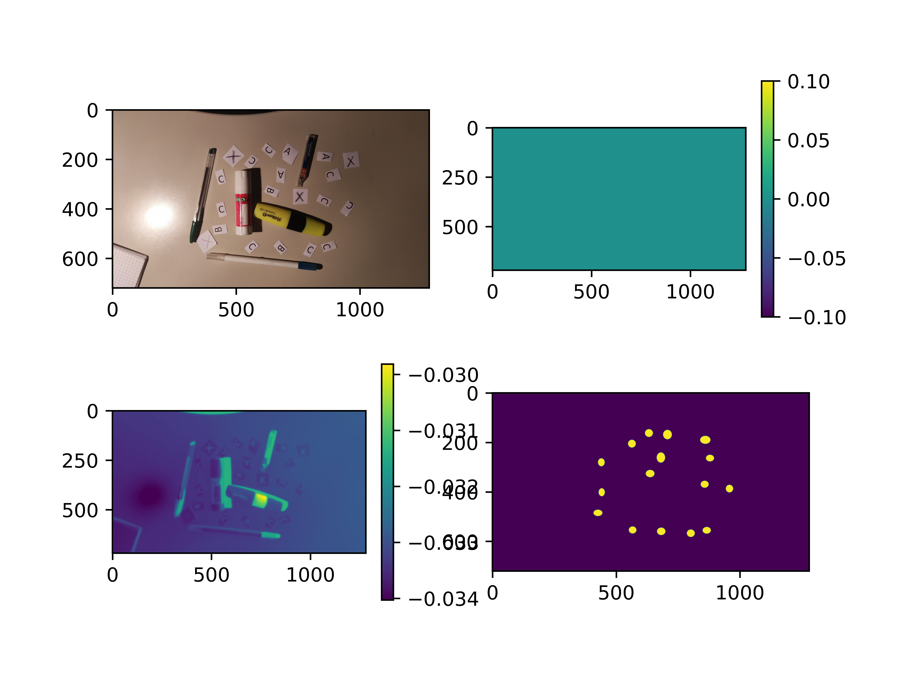

**Epoch 10**

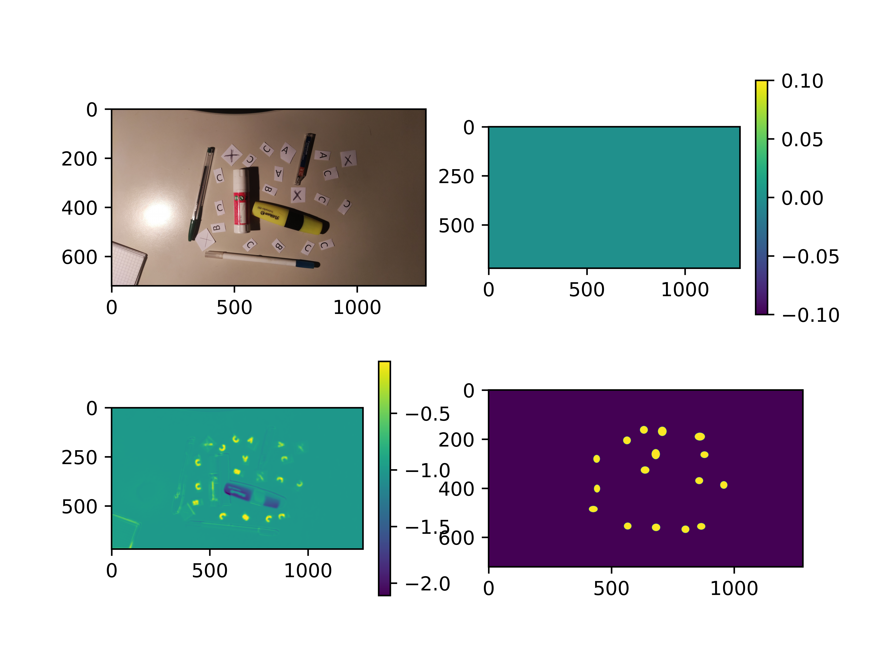

**Epoch 30**

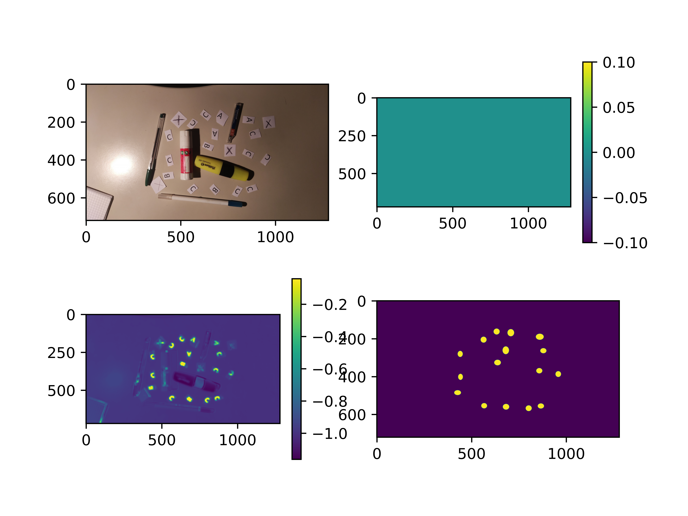

**Epoch 60**

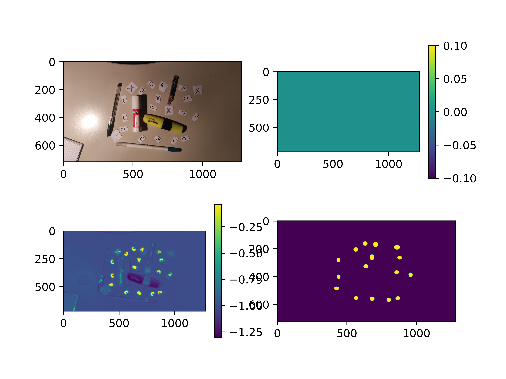

## Second model training

**Epoch 0**

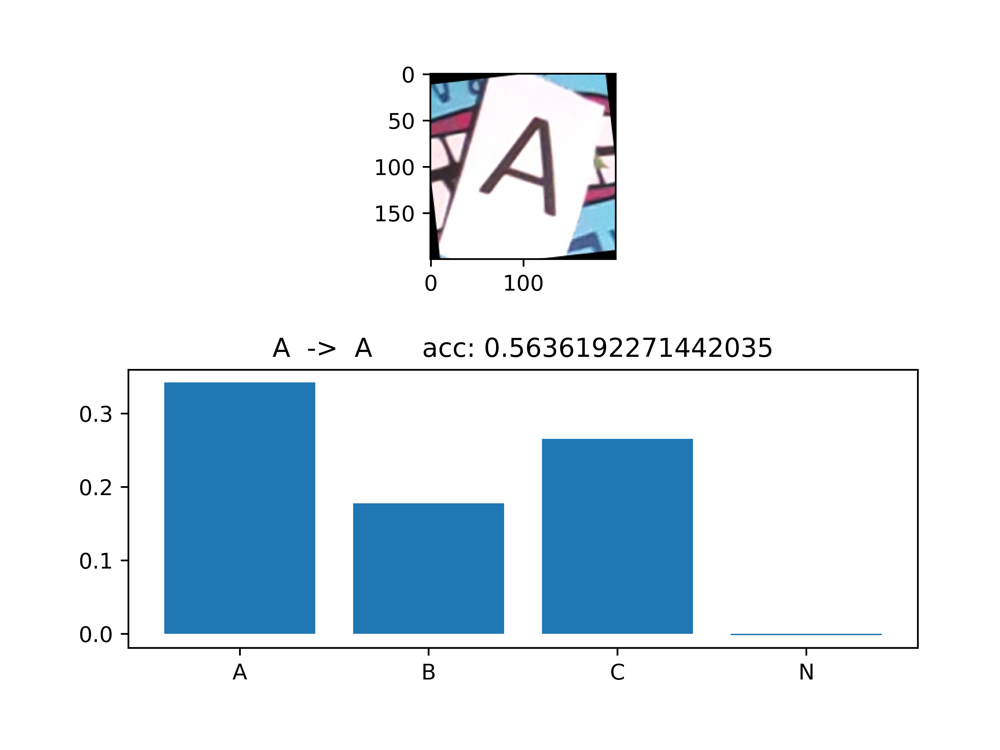

**Epoch 1**

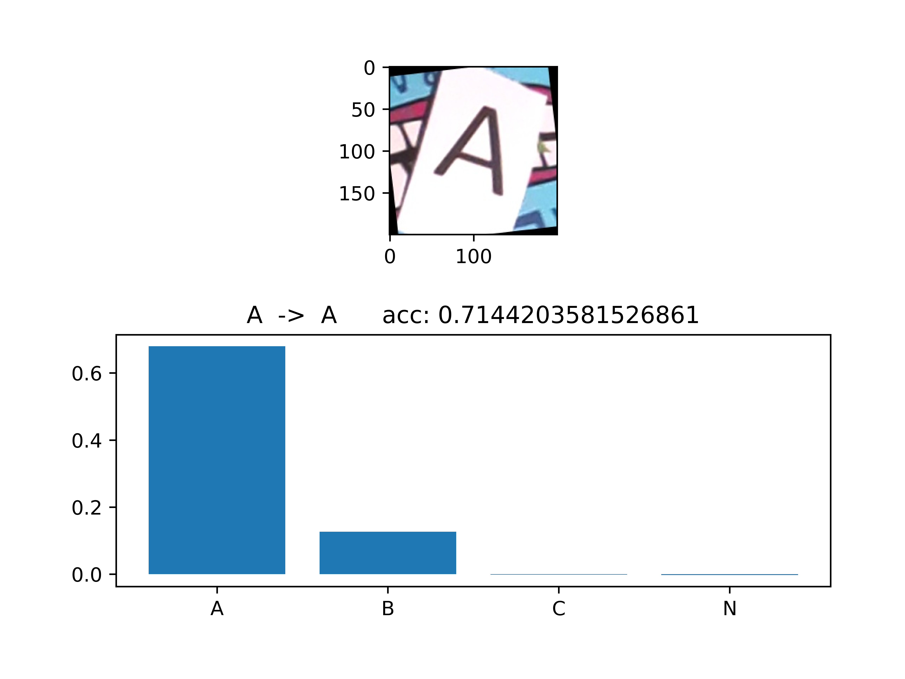

**Epoch 5**

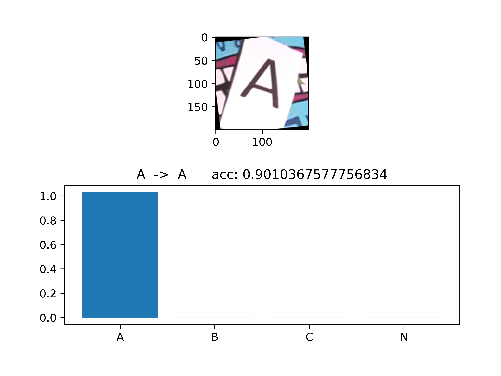

# Demo

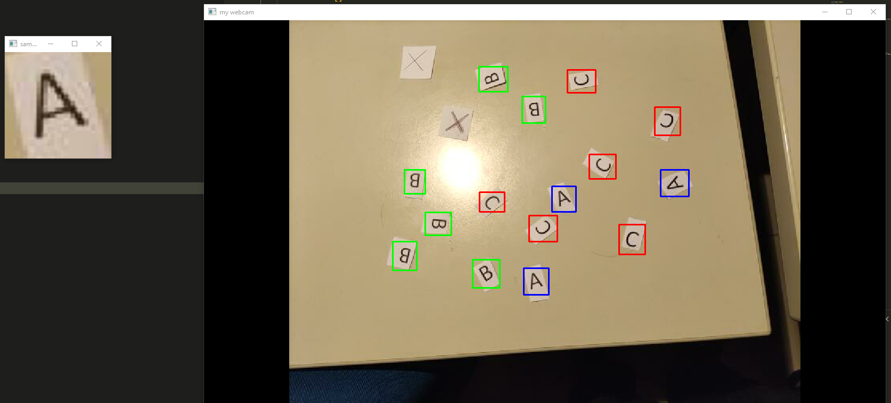

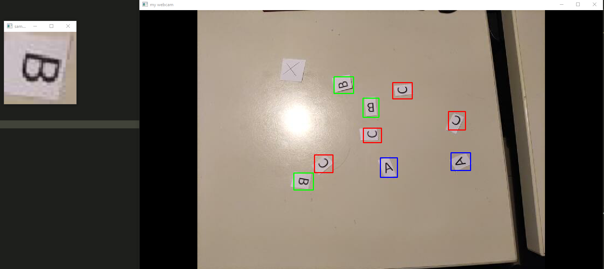

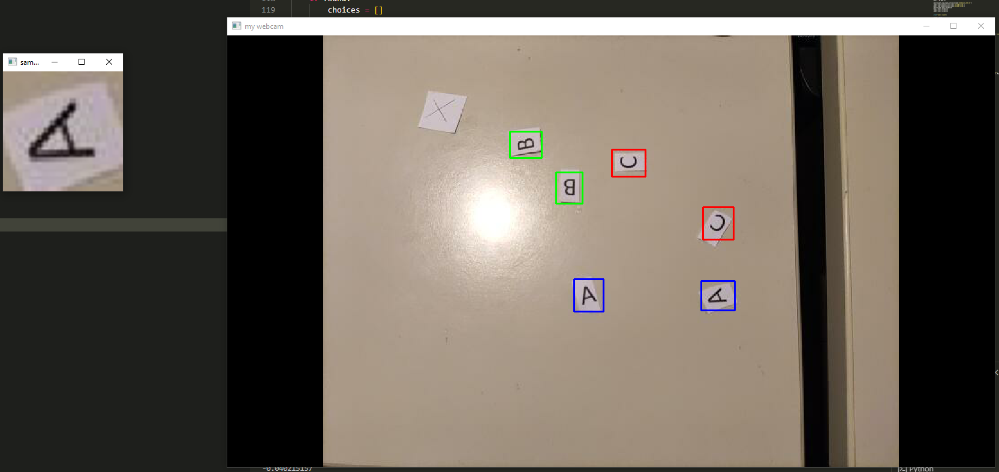

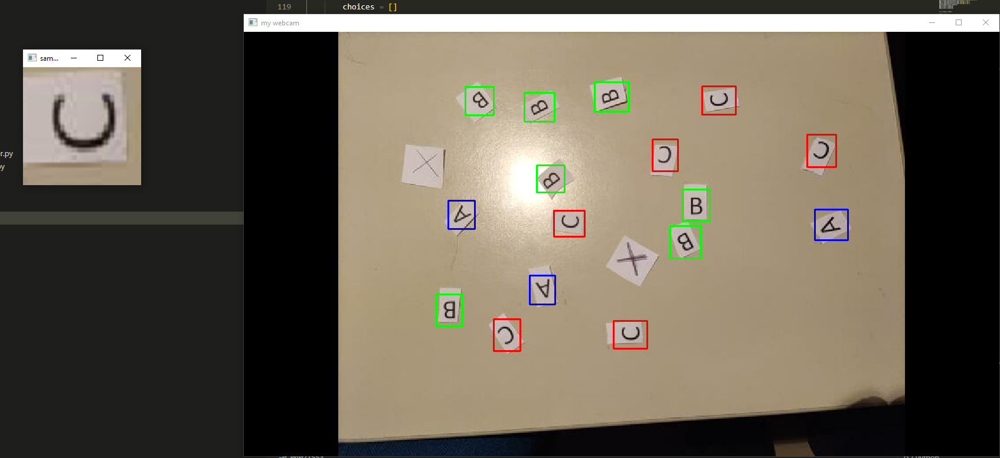

# [**video**]("examples/Demo.mp4)
